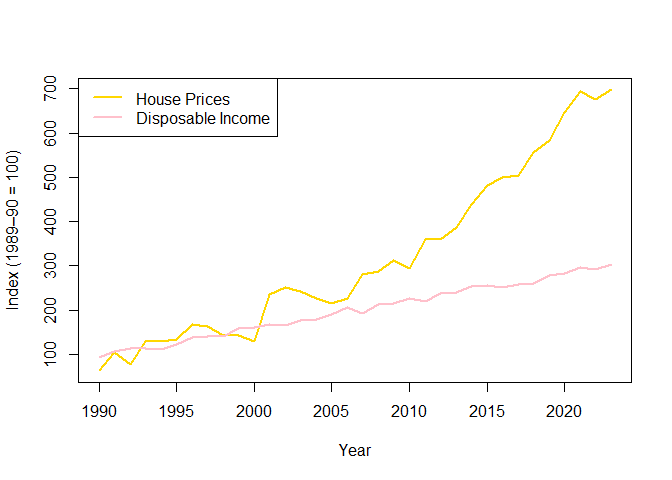

<!-- README.md is generated from README.Rmd. Please edit that file -->

# GoldinGroundOz

<!-- badges: start -->

<!-- badges: end -->

GoldinGroundOz is a small exploratory R package that demonstrates the
long-term relationship between Australia’s detached house prices,
household disposable income, and average capital gain rate changes. It
provides two simulated datasets and illustrative examples that explore
one of the hidden forces behind Australia’s surging housing prices — the
shifting patterns of capital gain rates, or how “gold lies beneath the
ground.”

## Installation

You can install the development version of GoldinGroundOz from
[GitHub](https://github.com/) with:

``` r
# install.packages("pak")
pak::pak("ETC5523-2025/assignment-4-packages-and-shiny-apps-Acrea-QwQ")
```

## Example

A simple example of exploring the included datasets:

``` r
library(GoldinGroundOz)

# Load the datasets
data("housepr_income")
data("capital_gain")

# Quick overview
head(housepr_income)
#>   year    income house_price
#> 1 1990  93.79697    62.51829
#> 2 1991 105.44149   103.79164
#> 3 1992 113.07616    76.21912
#> 4 1993 113.57105   128.17242
#> 5 1994 109.85777   129.47045
#> 6 1995 120.96476   134.05761
head(capital_gain)
#>      year                             phase    value
#> 1 1986-87 Before 50% capital gains discount 5887.859
#> 2 1987-88 Before 50% capital gains discount 2991.685
#> 3 1988-89 Before 50% capital gains discount 3131.357
#> 4 1989-90 Before 50% capital gains discount 3487.970
#> 5 1990-91 Before 50% capital gains discount 2885.084
#> 6 1991-92 Before 50% capital gains discount 5223.711

# Plot house prices vs disposable income
plot(
housepr_income$year, housepr_income$house_price,
type = "l", col = "gold", lwd = 2,
ylab = "Index (1989–90 = 100)", xlab = "Year"
)
lines(housepr_income$year, housepr_income$income, col = "pink", lwd = 2)
legend("topleft", legend = c("House Prices", "Disposable Income"),
col = c("gold", "pink"), lwd = 2)
```


