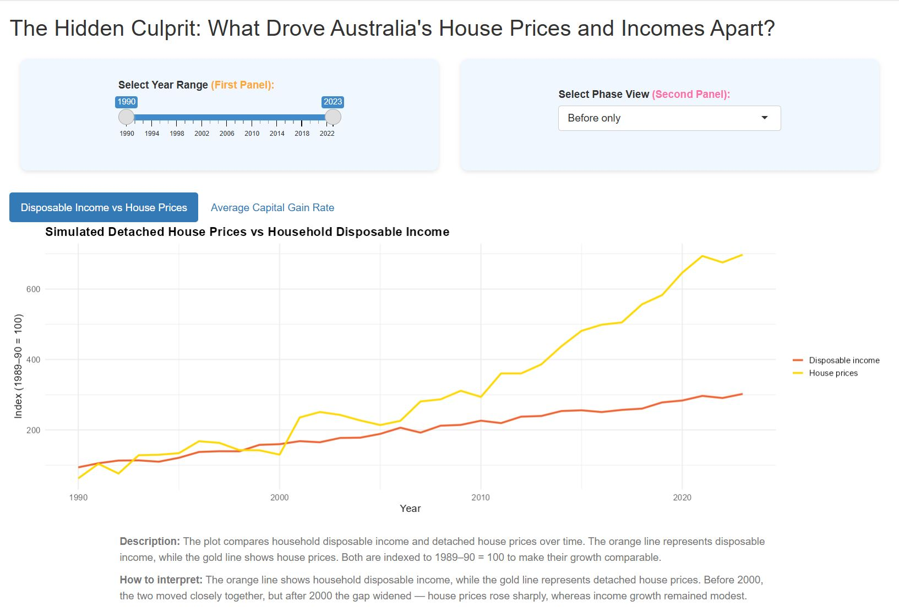

```{r, include = FALSE}
knitr::opts_chunk$set(
  collapse = TRUE,
  comment = "#>"
)
```

# Shiny App

This page demonstrates how to launch the Shiny application included in GoldinGroundOz.

You can use the following code to launch Shiny app:

```{r}
#| eval: false
library(GoldinGroundOz)
run_shinyapp()
```

Once it’s running, you’ll see a page like this:

<div align="center">{width=80%}</div>

— it’s packed with fun interactive features to help you explore the data. Go ahead and give it a try! 🎉

